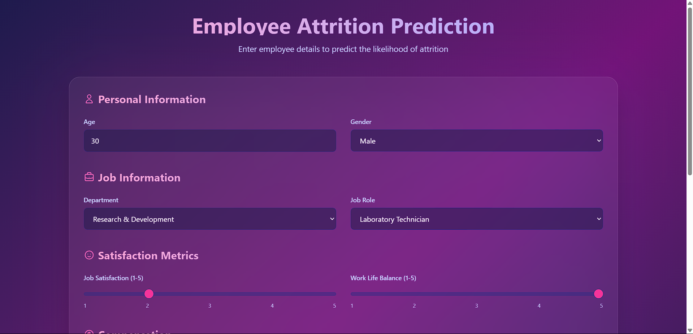

# Employee Attrition Prediction App

A modern web application that predicts employee attrition using machine learning. The application features a beautiful, responsive UI built with React and Tailwind CSS, coupled with a FastAPI backend for machine learning predictions.



## Features

- 🎯 **Accurate Predictions**: Uses a trained machine learning model to predict employee attrition
- 🎨 **Modern UI**: Clean and intuitive interface built with React and Tailwind CSS
- 📱 **Responsive Design**: Works seamlessly on desktop and mobile devices
- 🔄 **Real-time Updates**: Instant prediction results with probability scores
- 🎛️ **Interactive Controls**: Easy-to-use form inputs with sliders and dropdowns

## Input Parameters

### Personal Information
- Age
- Gender

### Job Information
- Department
- Job Role

### Satisfaction Metrics
- Job Satisfaction (1-5 scale)
- Work Life Balance (1-5 scale)

### Compensation
- Monthly Income
- Percent Salary Hike

## Tech Stack

- **Frontend**:
  - React
  - TypeScript
  - Tailwind CSS
  - Vite

- **Backend**:
  - FastAPI
  - scikit-learn
  - Python 3.10+

## Getting Started

### Prerequisites

- Node.js 16+
- Python 3.10+
- pip

### Installation

1. Clone the repository:
```bash
git clone <repository-url>
cd employee-attrition-prediction
```

2. Install frontend dependencies:
```bash
cd frontend
npm install
```

3. Install backend dependencies:
```bash
cd backend
pip install -r requirements.txt
```

### Running the Application

1. Start the frontend development server:
```bash
cd frontend
npm run dev
```

2. Start the backend server:
```bash
cd backend
uvicorn main:app --reload
```

The application will be available at:
- Frontend: http://localhost:5173
- Backend API: http://localhost:8000

## API Endpoints

- `POST /predict`: Accepts employee data and returns attrition prediction
  - Returns prediction (Yes/No) and probability score

## Contributing

1. Fork the repository
2. Create your feature branch (`git checkout -b feature/AmazingFeature`)
3. Commit your changes (`git commit -m 'Add some AmazingFeature'`)
4. Push to the branch (`git push origin feature/AmazingFeature`)
5. Open a Pull Request

## License

This project is licensed under the MIT License - see the [LICENSE](LICENSE) file for details. 